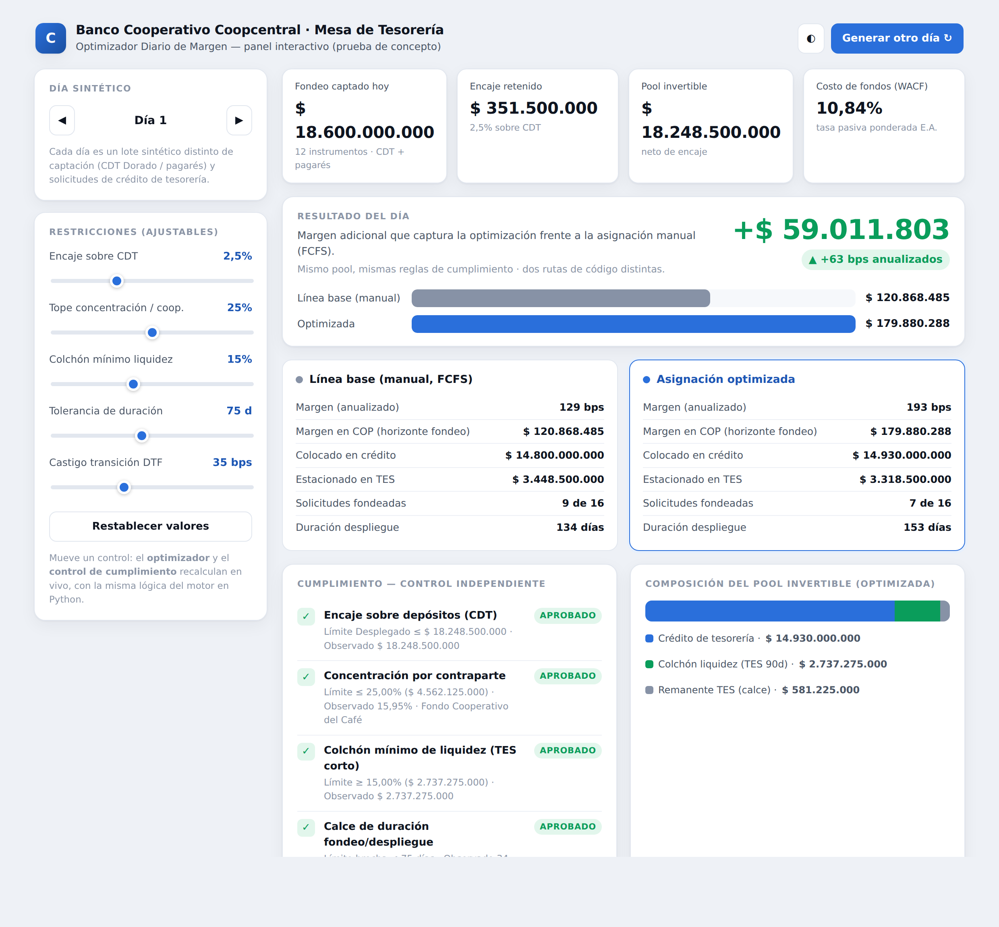

# Optimizador Diario de Margen de Tesorería — Coopcentral

Prueba de concepto para la mesa de **tesorería / renta fija** del **Banco
Cooperativo Coopcentral**. Simula **un día operativo** y muestra, lado a lado,
lo que habría ganado una asignación **manual (statu quo)** de los fondos del día
frente a lo que gana una asignación **optimizada** — cuantificado en **puntos
básicos (bps)** y en **pesos (COP)**.

Hay dos salidas, ambas en español:

1. **Panel interactivo** (`docs/dashboard.html`) — un tablero autocontenido donde
   se pueden **mover los parámetros de cumplimiento** (encaje, concentración,
   liquidez, tolerancia de duración, castigo DTF) y **cambiar de día**: el
   optimizador y el control de cumplimiento **recalculan en vivo**. Ábrelo con
   doble clic en cualquier navegador (no requiere servidor ni instalación).
2. **Informe de una página** (`reports/informe_tesoreria.html`) — un memo estático
   listo para imprimir/enviar a un supervisor, que genera el motor en Python.



> El panel reimplementa el **mismo modelo** que el motor en Python (los 7 agentes)
> para poder correr 100% en el navegador; los números caen en los mismos rangos.
> El motor en Python sigue siendo la fuente de verdad y produce el informe estático.

---

## Por qué está modelado sobre Coopcentral (y no un banco genérico)

Coopcentral es el banco **integrador del sector solidario/cooperativo** de
Colombia ("banco de bancos"): no atiende personas naturales, capta de y presta a
**cooperativas afiliadas**. La simulación usa su set de productos real:

- **Captación (lo que entró hoy):** emisiones de **CDT Dorado** (a término, tasa
  fija o indexada a DTF/IBR, plazos 90/180/360 días) y **pagarés a la orden con
  un solo vencimiento** (tasa fija, bullet).
- **Demanda (lo que se pide hoy):** solicitudes de **crédito de tesorería** de
  otras cooperativas afiliadas (corto plazo, ~90-180 días), cada una con monto,
  plazo y **calificación interna** (A/B/C/D) — la ventaja informativa de
  Coopcentral es su data histórica de relación con la red.
- **Mercado (tasas de referencia de hoy):** tasa de política del **BanRep**,
  curva **TES**, **DTF** e **IBR**, modelando explícitamente la **transición
  DTF→IBR** (la DTF deja de publicarse el 31/12/2026 y desde el 01/01/2027 se lee
  como IBR-3M E.A.; base legal: **Ley 2294 de 2023, art. 314**). Todo instrumento
  indexado a DTF se marca como *expuesto a transición*.

---

## Arquitectura de agentes

Cada agente vive en su propio módulo, inspeccionable por separado (útil para
mostrarle al jefe "esta es la pieza que valida cumplimiento" como algo distinto):

| Agente | Módulo | Qué hace |
|---|---|---|
| **Market Data** | `optimizer/market_data_agent.py` | Carga la fotografía de tasas del día desde CSV y marca los instrumentos indexados a DTF. |
| **Funding** | `optimizer/funding_agent.py` | Ingiere el lote de CDT/pagarés, descuenta el **encaje** (solo sobre CDT) y calcula el **pool invertible** y el **costo de fondos** (tasa pasiva promedio ponderada). |
| **Demand & Risk** | `optimizer/demand_risk_agent.py` | Puntúa cada solicitud y calcula un **rendimiento ajustado por pérdida esperada** (PD·LGD) y por el castigo de transición DTF. |
| **Baseline** | `optimizer/baseline_agent.py` | Heurístico **manual (FCFS)**: atiende por orden de llegada respetando controles básicos; estaciona el resto en TES. Es el statu quo. |
| **Optimization** | `optimizer/optimization_agent.py` | Busca la asignación que **maximiza el margen anualizado ajustado por riesgo** sujeta a todas las restricciones; devuelve la óptima **+ 2 alternativas**. |
| **Compliance / Guardrail** | `optimizer/guardrail_agent.py` | **Re-valida de forma independiente** encaje, concentración, liquidez y calce de duración. Lo que no aprueba, se descarta. |
| **Reporting** | `optimizer/reporting_agent.py` | Produce el **informe de una página en español** (único output que ve un lector no técnico). |

Orquestador de punta a punta: **`run_daily_optimization.py`**.

---

## Cómo correrlo

Sin dependencias externas (solo librería estándar de **Python 3.9+**):

```bash
python run_daily_optimization.py                 # corrida por defecto (reproducible)
python run_daily_optimization.py --regenerar     # genera un nuevo día sintético
python run_daily_optimization.py --semilla 7     # otro día sintético
python run_daily_optimization.py --fecha 2026-07-17 --salida reports/dia.html
```

Genera/usa los CSV de entrada en `data/` y escribe el informe en
`reports/informe_tesoreria.html`.

---

## Restricciones regulatorias / estructurales (parámetros nombrados y ajustables)

Todo en `optimizer/config.py`, para que un revisor de cumplimiento los vea sin
bucear en la lógica:

| Parámetro | Valor por defecto | Significado |
|---|---|---|
| `ENCAJE_PCT` | 2,5% | Encaje sobre nuevos CDT (< 18 meses). Pagarés exentos. |
| `MAX_COUNTERPARTY_PCT` | 25% | Tope de concentración de crédito por cooperativa. |
| `MIN_LIQUIDITY_PCT` | 15% | Colchón mínimo de liquidez en TES corto. |
| `DURATION_TOLERANCE_DAYS` | 75 | Tolerancia de calce de duración fondeo/despliegue. |
| `MAX_TENOR_PARKING_DIAS` | 720 | Tenor máximo de TES para estacionar fondos del día. |
| `DTF_TRANSITION_HAIRCUT_BPS` | 35 | Castigo al atractivo de un despliegue indexado a DTF. |
| `PD_POR_CALIFICACION`, `LGD_PCT` | A/B/C/D; 45% | Parámetros de pérdida esperada. |

---

## Metodología (para poder defenderla ante preguntas)

- **Margen anualizado (bps):** spread promedio ponderado por monto entre el
  rendimiento ajustado por riesgo y el costo de fondos. Es **neutral al plazo**:
  la métrica comparable.
- **Margen en COP:** ese margen anualizado llevado a un **horizonte de fondeo
  común** (idéntico para ambas estrategias). Así el **delta en COP no es un
  artefacto de plazos**: refleja mejor selección, no simplemente activos más
  largos.
- **La comparación es real, de dos rutas de código distintas.** La línea base
  (FCFS) y la optimización (búsqueda exhaustiva de subconjuntos) son algoritmos
  diferentes. Ambas operan bajo **las mismas restricciones y el mismo horizonte**,
  por lo que la asignación de la línea base está dentro del espacio factible del
  optimizador: **el delta nunca es negativo por construcción** y proviene solo de
  seleccionar mejor (descartar créditos cuyo rendimiento ajustado por riesgo
  queda por debajo de un TES, respetar concentración y calce, y penalizar la
  exposición a DTF).
- **El Guardrail recalcula todo de forma independiente** desde las posiciones de
  la asignación; no confía en los números del optimizador.

---

## Datos

Los lotes diarios son **sintéticos/ilustrativos**, con la forma de la actividad
real de Coopcentral y niveles de mercado de julio de 2026 (BanRep ~12%, TES 10a
~13,2%). Los **nombres de cooperativas son inventados**: no corresponden a
contrapartes, estados financieros ni posiciones reales. Pendiente de aprobación
para conectar con datos reales de la mesa.

## Estructura del repositorio

```
run_daily_optimization.py     # orquestador de punta a punta
optimizer/
  config.py                   # parámetros ajustables + tasas de referencia
  domain.py                   # modelo de dominio y utilidades financieras
  data_generation.py          # generación del lote diario sintético
  market_data_agent.py        # ... un módulo por agente ...
  funding_agent.py
  demand_risk_agent.py
  baseline_agent.py
  optimization_agent.py
  guardrail_agent.py
  reporting_agent.py
  rationale.py                # racional en lenguaje llano
data/                         # CSV de entrada (config/ejemplo)
reports/                      # informe generado (salida)
docs/
  dashboard.html              # PANEL INTERACTIVO (abrir en el navegador)
  dashboard_preview.png       # vista previa del panel
  informe_ejemplo.html        # informe estático de ejemplo
tests/                        # pruebas (unittest, solo stdlib)
```

## Panel interactivo vs. motor Python

- **Para explorar y presentar** (mover parámetros, cambiar de día en vivo): abre
  `docs/dashboard.html`.
- **Para generar el memo estático** o integrar con datos reales: usa el motor en
  Python (`run_daily_optimization.py`), que es la fuente de verdad del modelo.
